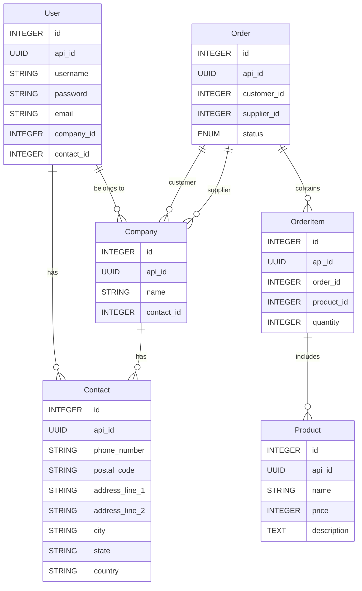

# django_order_product

A simple Django application for managing orders and products.

Libraries used:
    - django 5.2
    - djangorestframework 3.16.0
    - djangorestframework-simplejwt 5.5.0
    - python-dotenv 1.1.0
    - django-filter 25.1
    - drf-standardized-errors 0.14.1
    - drf-spectacular 0.28.0
    - dj-rest-auth 7.0.1
    - django-debug-toolbar 5.1.0

## Features

- **User Management**: Custom user model with support for companies and contacts.
- **Order Management**: Create, update, and manage orders with multiple products.
- **Product Management**: Manage products with pricing and descriptions.
- **API Documentation**: Automatically generated Swagger and Redoc documentation using `drf-spectacular`.
- **Filtering and Searching**: Advanced filtering and searching for products, orders, and companies.
- **Admin Panel**: Fully customized admin interface for managing orders, products, and users.
- **Debugging Tools**: Integrated Django Debug Toolbar for easier debugging.


## How to Set Up and Run the Project Using `uv`
`uv` is a Python project management tool that simplifies dependency management and project setup.

1. **Clone the Repository**: Clone the project repository to your local machine.

2. **Install `uv`**: `uv` is a tool for managing Python projects. Follow the installation guide at [Official `uv` Documentation](https://docs.astral.sh/uv/).

3. **Initialize the Project**: Run the following command:
    ```bash
    uv init
    ```

4. **Set Up Environment Variables**: The `.env.example` file is included in the repository. Copy it to `.env` and update the values as needed. Below are the key variables you should configure:
    - `DJANGO_SECRET_KEY`: A secret key for Django's cryptographic signing.
    - `DJANGO_DEBUG`: Set to `True` to enable debug mode for development, or `False` for production.

5. **Create Migrations**: This step generates database migration files based on your models, which define the structure of your database. Run the following command to generate the database migrations:
    ```bash
    uv run backend/manage.py makemigrations
    ```

6. **Run Migrations**: Apply the migrations to set up the database schema by running the following command:
    ```bash
    uv run backend/manage.py migrate
    ```

7. **Create a Superuser**: Create an admin user for accessing the admin panel by running the following command:
    ```bash
    uv run backend/manage.py createsuperuser
    ```
    *Note*: This user will have administrative privileges to manage the application through the admin panel.
8. **Run the Django Server**: Start the development server by running the following command:
    ```bash
    uv run backend/manage.py runserver
    ```
    The server will run on `http://127.0.0.1:8000/` by default.

### Access the Application

- **Admin Panel**: [http://127.0.0.1:8000/admin/](http://127.0.0.1:8000/admin/)
- **API Documentation (Swagger)**: [http://127.0.0.1:8000/api/schema/swagger-ui/](http://127.0.0.1:8000/api/schema/swagger-ui/)
- **API Documentation (Redoc)**: [http://127.0.0.1:8000/api/schema/redoc/](http://127.0.0.1:8000/api/schema/redoc/)

## ORM Diagram

Below is a Mermaid diagram representing the relationships between the models in the project:

